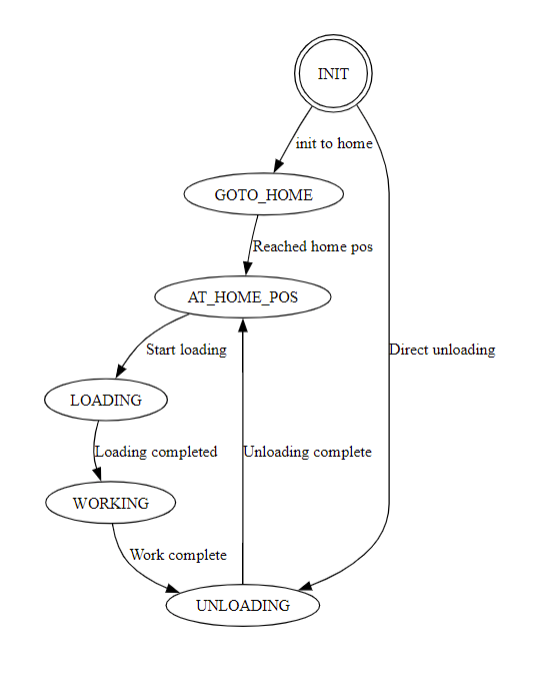
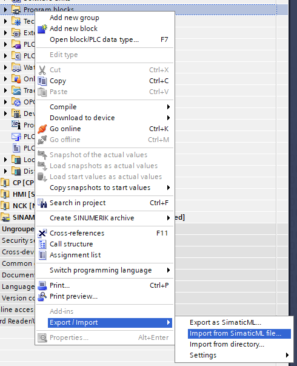
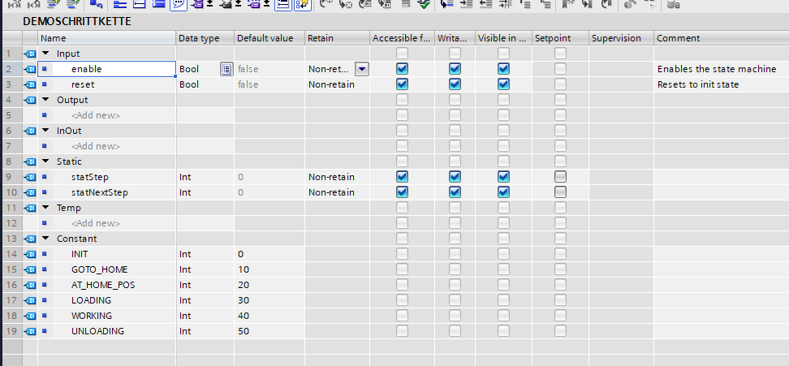
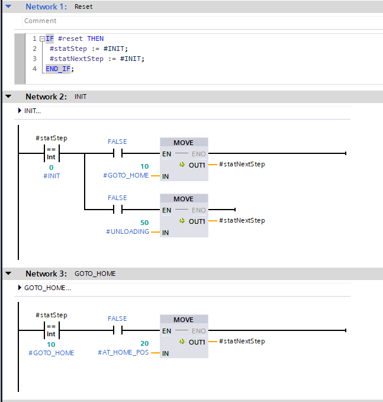
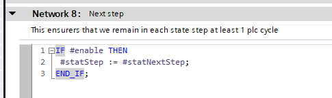

# State machine generation Siemens TIA-Portal

Library for generation of state-machine templates FB in Siemens TIA-Portal.

The main purpose is to be able to design the state machine before starting to program in TIA, the generated state diagram can be used to verify the desired function and can be used for software documentation.


## Workflow

1. Design the state machine with `Events`, that have a source state, destination state and transition name.
2. Verify that the generated state diagram reflects the desired behaviour.
3. Generate Simatic-ML file and import into TIA
4. Add your input/output signals and connect them to states or trigger transitions.

# Example
```python
import graph2LAD
from graph2LAD import Event


events = [Event('INIT','GOTO_HOME','init to home'),
        Event('GOTO_HOME','AT_HOME_POS','Reached home pos'),
        Event('AT_HOME_POS','LOADING','Start loading'),
        Event('LOADING','WORKING','Loading completed'),
        Event('WORKING','UNLOADING','Work complete'),
        Event('UNLOADING','AT_HOME_POS','Unloading complete'),
        Event('INIT','UNLOADING','Direct unloading')]


graph2LAD.render_graph(events,init_state='INIT',fname='demo')
graph2LAD.export_graph(events,'INIT','DemoSchrittKette','demo_FB',45)
```

State diagram



Import into TIA



Interface of generated FB



State networks in generated FB



Last network, the static variables `statStep`and `statNextStep`ensures that we remain in each state for at least 1 PLC cycle.



# Installation

1. Install GraphViz https://graphviz.org/
2. `pip install graphviz`
3. TIA Export/Import Add-in (https://support.industry.siemens.com/cs/document/109773999/tia-add-ins?dti=0&lc=en-SE)
