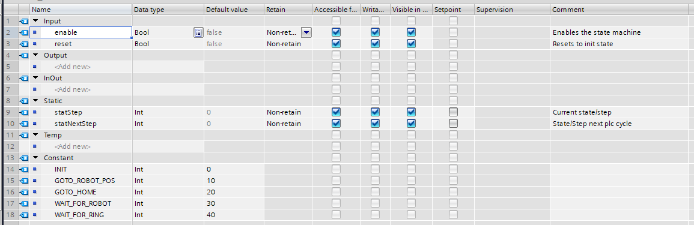
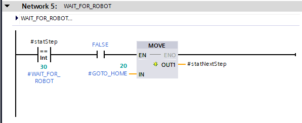
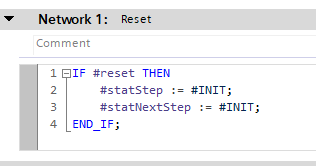

# Simatic ML Format

This shows the main components in the Simatic ML file.


## Block interface



```xml
<Interface><Sections xmlns="http://www.siemens.com/automation/Openness/SW/Interface/v5">
  <Section Name="Input">
    <Member Name="enable" Datatype="Bool">
      <Comment>
        <MultiLanguageText Lang="sv-SE">Enables the state machine</MultiLanguageText>
      </Comment>
    </Member>
    <Member Name="reset" Datatype="Bool">
      <Comment>
        <MultiLanguageText Lang="sv-SE">Resets to init state</MultiLanguageText>
      </Comment>
    </Member>
  </Section>
  <Section Name="Output" />
  <Section Name="InOut" />
  <Section Name="Static">
    <Member Name="statStep" Datatype="Int">
      <Comment>
        <MultiLanguageText Lang="sv-SE">Current state/step</MultiLanguageText>
      </Comment>
    </Member>
    <Member Name="statNextStep" Datatype="Int">
      <Comment>
        <MultiLanguageText Lang="sv-SE">State/Step next plc cycle</MultiLanguageText>
      </Comment>
    </Member>
  </Section>
  <Section Name="Temp" />
  <Section Name="Constant">
    <Member Name="INIT" Datatype="Int">
      <StartValue>0</StartValue>
    </Member>
    <Member Name="GOTO_ROBOT_POS" Datatype="Int">
      <StartValue>10</StartValue>
    </Member>
    <Member Name="GOTO_HOME" Datatype="Int">
      <StartValue>20</StartValue>
    </Member>
    <Member Name="WAIT_FOR_ROBOT" Datatype="Int">
      <StartValue>30</StartValue>
    </Member>
    <Member Name="WAIT_FOR_RING" Datatype="Int">
      <StartValue>40</StartValue>
    </Member>
  </Section>
</Sections></Interface>
```

## LAD Network




```xml
<NetworkSource><FlgNet xmlns="http://www.siemens.com/automation/Openness/SW/NetworkSource/FlgNet/v4">
  <Parts>
    <Access Scope="LocalVariable" UId="21">
      <Symbol>
        <Component Name="statStep" />
      </Symbol>
    </Access>
    <Access Scope="LocalConstant" UId="22">
      <Constant Name="WAIT_FOR_ROBOT" />
    </Access>
    <Access Scope="LiteralConstant" UId="23">
      <Constant>
        <ConstantType>Bool</ConstantType>
        <ConstantValue>FALSE</ConstantValue>
      </Constant>
    </Access>
    <Access Scope="LocalVariable" UId="24">
      <Symbol>
        <Component Name="statNextStep" />
      </Symbol>
    </Access>
    <Access Scope="LocalConstant" UId="25">
      <Constant Name="GOTO_HOME" />
    </Access>
    <Part Name="Eq" UId="26">
      <TemplateValue Name="SrcType" Type="Type">Int</TemplateValue>
    </Part>
    <Part Name="Contact" UId="27" />
    <Part Name="Move" UId="28" DisabledENO="true">
      <TemplateValue Name="Card" Type="Cardinality">1</TemplateValue>
    </Part>
  </Parts>
  <Wires>
    <Wire UId="29">
      <Powerrail />
      <NameCon UId="26" Name="pre" />
    </Wire>
    <Wire UId="30">
      <IdentCon UId="21" />
      <NameCon UId="26" Name="in1" />
    </Wire>
    <Wire UId="31">
      <IdentCon UId="22" />
      <NameCon UId="26" Name="in2" />
    </Wire>
    <Wire UId="32">
      <NameCon UId="26" Name="out" />
      <NameCon UId="27" Name="in" />
    </Wire>
    <Wire UId="33">
      <IdentCon UId="23" />
      <NameCon UId="27" Name="operand" />
    </Wire>
    <Wire UId="34">
      <NameCon UId="27" Name="out" />
      <NameCon UId="28" Name="en" />
    </Wire>
    <Wire UId="35">
      <IdentCon UId="25" />
      <NameCon UId="28" Name="in" />
    </Wire>
    <Wire UId="36">
      <NameCon UId="28" Name="out1" />
      <IdentCon UId="24" />
    </Wire>
  </Wires>
</FlgNet></NetworkSource>
```


## SCL Network



Where `reset` is an input signal to the FB, `statStep`, `statNextStep` are static variables and `INIT` is a constant in the FB.

```xml
<NetworkSource><StructuredText xmlns="http://www.siemens.com/automation/Openness/SW/NetworkSource/StructuredText/v3">
  <Token Text="IF" UId="21" />
  <Blank UId="22" />
  <Access Scope="LocalVariable" UId="23">
    <Symbol UId="24">
      <Component Name="reset" UId="25" />
    </Symbol>
  </Access>
  <Blank UId="26" />
  <Token Text="THEN" UId="27" />
  <NewLine UId="28" />
  <Blank Num="4" UId="29" />
  <Access Scope="LocalVariable" UId="30">
    <Symbol UId="31">
      <Component Name="statStep" UId="32" />
    </Symbol>
  </Access>
  <Blank UId="33" />
  <Token Text=":=" UId="34" />
  <Blank UId="35" />
  <Access Scope="LocalConstant" UId="36">
    <Constant Name="INIT" UId="37" />
  </Access>
  <Token Text=";" UId="40" />
  <NewLine UId="41" />
  <Blank Num="4" UId="42" />
  <Access Scope="LocalVariable" UId="43">
    <Symbol UId="44">
      <Component Name="statNextStep" UId="45" />
    </Symbol>
  </Access>
  <Blank UId="46" />
  <Token Text=":=" UId="47" />
  <Blank UId="48" />
  <Access Scope="LocalConstant" UId="49">
    <Constant Name="INIT" UId="50" />
  </Access>
  <Token Text=";" UId="53" />
  <NewLine UId="54" />
  <Token Text="END_IF" UId="55" />
  <Token Text=";" UId="56" />
</StructuredText></NetworkSource>
```

